# BBP Formula

## Part I - Introduction to Java Threads

## Compile and run instructions.

Para ejecutar la primera parte es necesario compilar el paquete y luejo ejecutarlo en la carpeta **PARALLELISM-JAVA_THREADS_MAVEN-INTRODUCTION_BBP_FORMULA** de la siguiente manera.

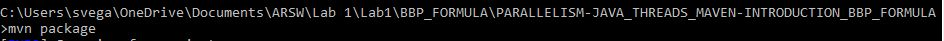
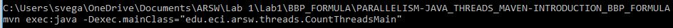  

1.	As reviewed in the readings, complete the CountThread classes, so that they define the life cycle of a thread that prints the numbers between A and B. 
 
 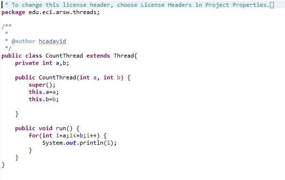 

2.	Complete the main method of the CountMainThreads class so that: 
	1.	Create 3 threads of type CountThread, assigning the first one the interval [0..99], the second one [99..199], and the third one [200..299].
	
	 	
	
	2.	Start all three threads with start(). 
	
	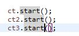
	
	3.	Run and check the output on screen. 
	
	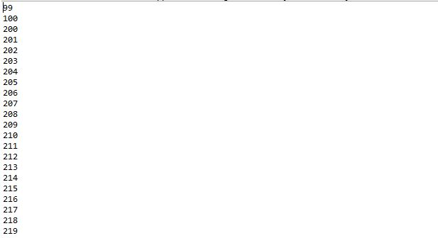
	
	4.	Change the beginning with start() to run(). How does the output change? Why?
	
	El output cambia debido a que con **start()** cada hilo corre sin importar si otros hilos al que ya se les dio la misma instruccion estan corriendo tambien, mientras que con **run()** cada hilo corre desde el principio hasta el final.
	
	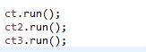
	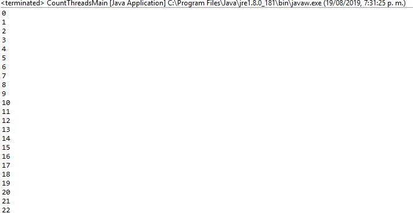

## Part II - BBP Formula Exercise

## Compile and run instructions.

Para ejecutar la segunda parte es necesario compilar el paquete y luejo ejecutarlo en la carpeta **PARALLELISM-JAVA_THREADS_MAVEN-INTRODUCTION_BBP_FORMULA** de la siguiente manera.

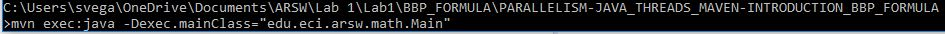 

The BBP formula (Bailey – Borwein – Plouffe formula) is an algorithm that allows you to calculate the nth digit of PI in base 16, with the particularity of not needing to calculate us n-1 previous digits. This feature makes it possible to convert the problem of calculating a massive number of PI digits (in base 16) to a shamefully parallel one. In this repository you will find the implementation, along with a set of tests.
For this exercise you want to calculate, in the shortest possible time, and in a single machine (taking advantage of the multi-core characteristics of the same) at least the first million digits of PI (in base 16).
1.	Create a Thread type class that represents the life cycle of a thread that calculates a portion of the required digits. 
	
	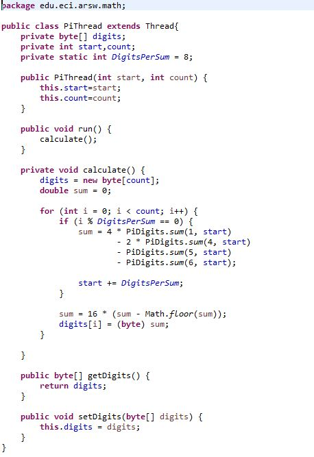
	
2.	Have the PiDigits.getDigits() function receive as an additional parameter an N value, corresponding to the number of threads between which the solution is to be parallelized. Have that function wait until the N threads finish solving the problem to combine the answers and then return the result. For this, review the join method of the Java concurrency API. 
	
	Implementacion del nuevo metodo getDigits() usando join()
	
	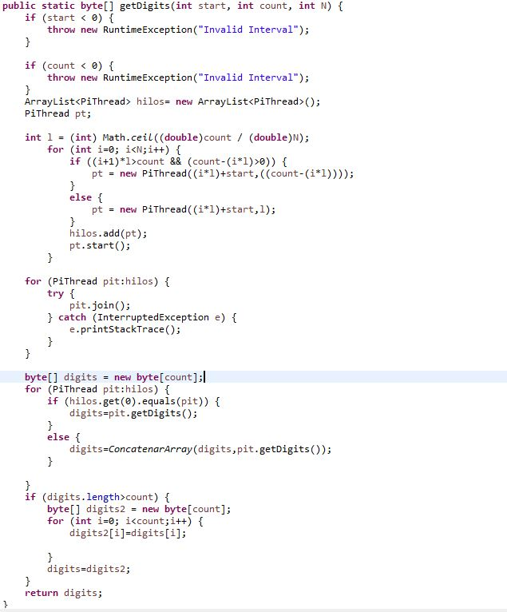
	
3.	Adjust the JUnit tests, considering the cases of using 1, 2 or 3 threads (the last one to consider an odd number of threads!)
	
	Implementacion de una nueva prueba JUnit que usa el nuevo metodo getDigits() para probar con 1,2 y 3 hilos.
	
	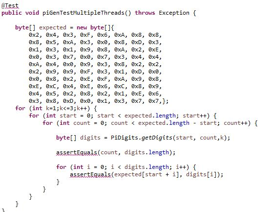
	
	Ejecución de las pruebas.
	
	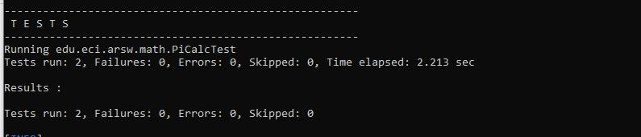

## Part III - Performance Evaluation
From the above, implement the following sequence of experiments to calculate the million digits (hex) of PI, taking their execution times (be sure to do them on the same machine):
1.	Single thread. 

	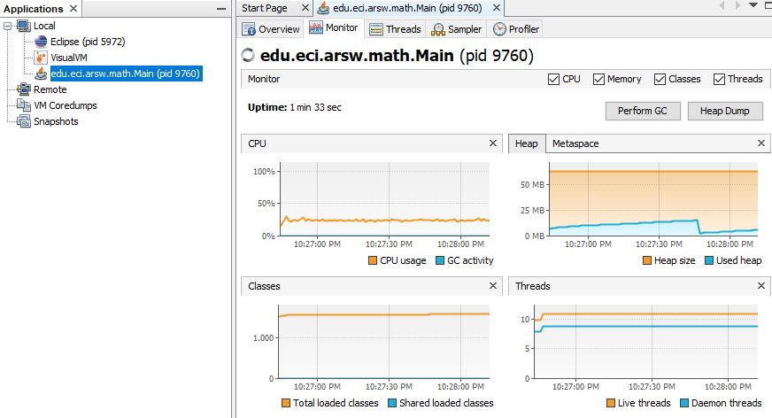

2.	As many threads as processing cores (have the program determine this using the Runtime API). 

	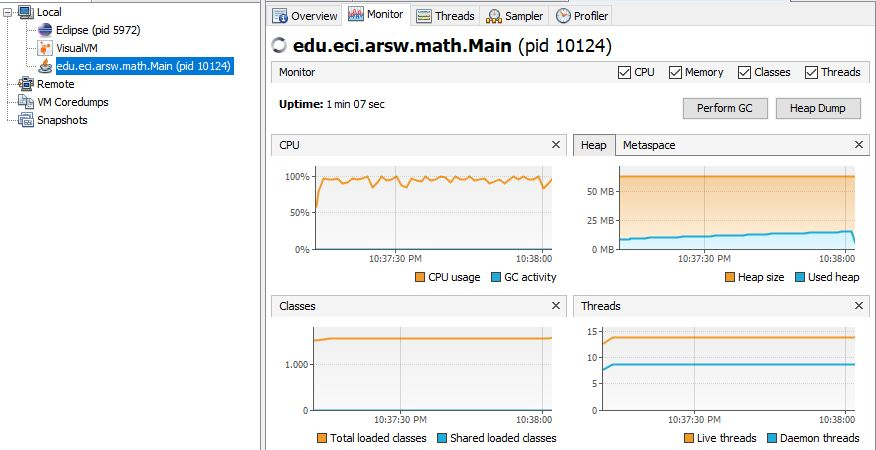
	
3.	So many threads as double processing cores. 

	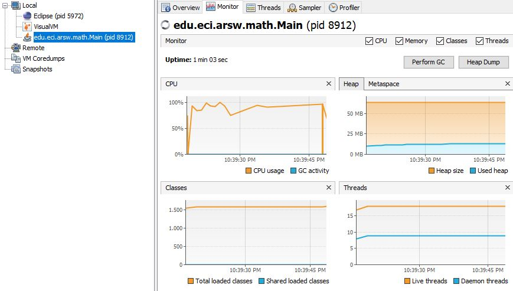

4.	200 threads.

	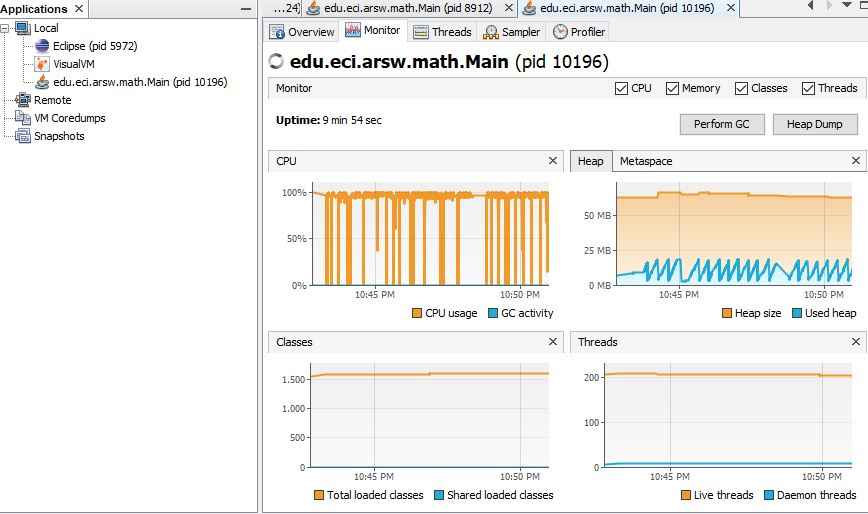

5.	500 threads 

	