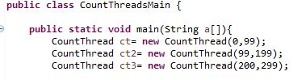

# BBP Formula

## Part I - Introduction to Java Threads
1.	As reviewed in the readings, complete the CountThread classes, so that they define the life cycle of a thread that prints the numbers between A and B. 
 
  

2.	Complete the main method of the CountMainThreads class so that: 
	1.	Create 3 threads of type CountThread, assigning the first one the interval [0..99], the second one [99..199], and the third one [200..299].
	
	 	
	
	2.	Start all three threads with start(). 
	
	
	
	3.	Run and check the output on screen. 
	
	
	
	4.	Change the beginning with start() to run(). How does the output change? Why?
	
	El output cambia debido a que con "start()" cada hilo corre sin importar si otros hilos al que ya se les dio la misma instruccion estan corriendo tambien, mientras que con "run()" cada hilo corre desde el principio hasta el final.
	
	
	
	 