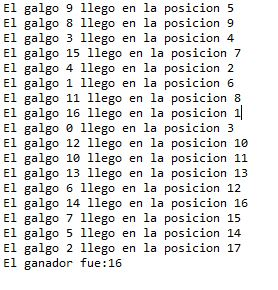

# Dogs Race case

## Part I

## Compile and run instructions.

Para ejecutar la primera parte es necesario compilar el paquete y luego ejecutarlo en la carpeta **CONCURRENT_PROGRAMMING-JAVA_MAVEN-DOGS_RACE\parte1** de la siguiente manera.

 

Creation, commissioning and coordination of threads.

1.	Review the "concurrent cousins" program (in the folder part1), provided in the package edu.eci.arsw.primefinder. This is a program that calculates the prime numbers between two intervals, distributing their search among independent threads. For now, it has a single thread that seeks cousins ​​between 0 and 30,000,000. Run it, open the operating system process manager, and verify how many cores are used by it.

	 
	
	Uso de CPU durante la corrida del programa con un solo hilo.
	
	 

2.	Modify the program so that, instead of solving the problem with a single thread, do it with three, where each of these will make up the first part of the original problem. Check the operation again, and again check the use of the equipment cores.
	
	 
	
	Uso de CPU durante la corrida del programa con tres hilos.
	
	

3.	What you have been asked for is: you must modify the application so that when 5 seconds have elapsed since the execution started, all the threads are stopped and the number of primes ​​found so far is displayed. Then, you must wait for the user to press ENTER to resume their execution.

## Part III

## Compile and run instructions.

Para ejecutar la carrera es necesario compilar el paquete y luego ejecutarlo en la carpeta **CONCURRENT_PROGRAMMING-JAVA_MAVEN-DOGS_RACE\parte2** de la siguiente manera.

 

1.	Fix the application so that the results notice is shown only when the execution of all the ‘greyhound’ threads is finished. For this keep in mind:
	1.	The action of starting the race and showing the results is carried out from line 38 of MainCanodromo.
	2.	The join() method of the Thread class can be used to synchronize the thread that starts the race, with the completion of the greyhound threads.

		Se añade un join() despues de que se inician los hilos para que se sincronizen. 
	
		 
	
		Y al ejecutar vemos que ya se menciona correctamente quien es el ganador, pero aun hay un error y es que pueden quedar dos Galgos en la misma posicion.
	
		 

2.	Once the initial problem has been corrected, run the application several times, and identify the inconsistencies in the results of the same by seeing the ‘ranking’ shown on the console (sometimes valid results could appear, but in other cases such inconsistencies may occur). From this, identify the critical regions of the program.

	La region critica se encuentra en la clase RegistroLlegada en los siguientes metodos, ya que estos son llamados por los hilos al mismo tiempo y es lo que esta generando inconsistencias.
	
	

3.	Use a synchronization mechanism to ensure that these critical regions only access one thread at a time. Verify the results.

	Se usa Atomicidad para poder incrementar uno por uno el contador de posiciones de los galgos.
	
	
	
	
	
	Asi en la clase Galgo solo seria necesario llamar a un metodo que no generara inconsistencias.
	
	
	
	Comprobando nos damos cuenta que ya no hay posiciones repetidas.
	
	
	
	

4.	Implement the pause and continue functionalities. With these, when "Stop" is clicked, all the threads of the greyhounds should fall asleep, and when "Continue" is clicked they should wake up and continue with the race. Design a solution that allows you to do this using the synchronization mechanisms with the Locks primitives provided by the language (wait and notifyAll).
	
	Se implementa un wait en cada hilo que sea activado cada que la carrera se pause y un notifyAll que notifique cuando se reanude.
	
	
	
	
	Durante la ejecucion observamos que la carrera se detiene cuando se oprime "Stop" y se reanuda y termina cuando se oprime "Continue"
	
	
	
	